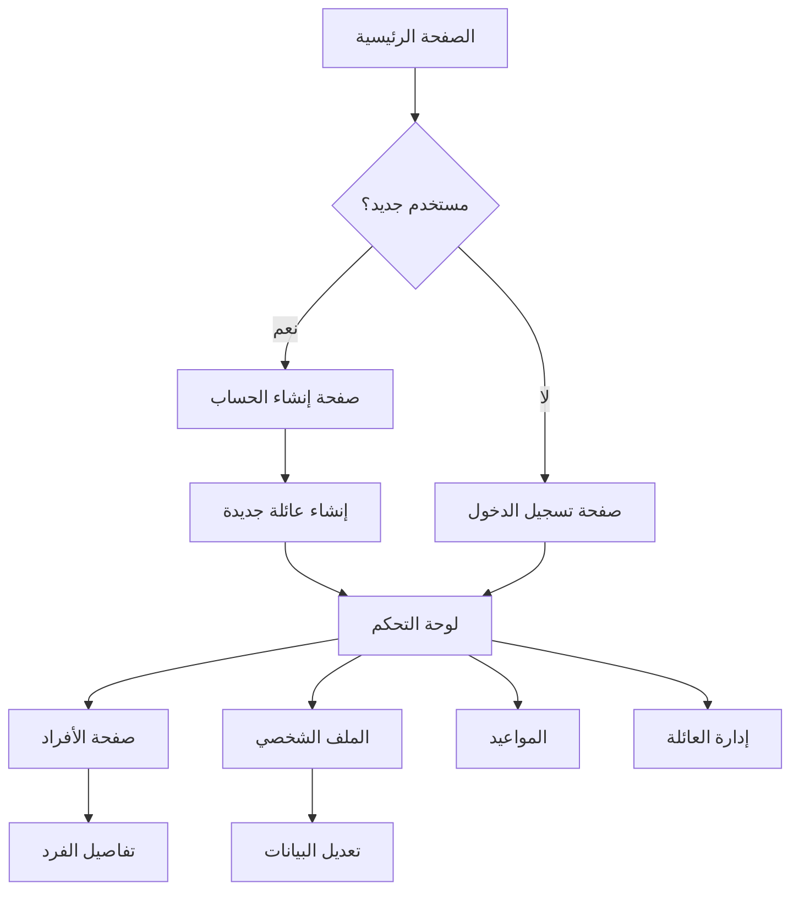

## 1. نظرة عامة على المنتج
تطبيق "عائلة ابشر" هو نظام إلكتروني متكامل لإدارة شؤون الأسر وربط الأفراد بعوائلهم. يهدف إلى تسهيل إدارة البيانات العائلية وتوفير منصة مركزية للتواصل وإدارة المواعيد والتنبيهات.

- يحل مشكلة تشتت بيانات العائلة وصعوبة إدارة العلاقات الأسرية
- يستهدف الأسر السعودية والعربية التي تبحث عن تنظيم أمورها بطريقة رقمية
- يوفر قيمة سوقية من خلال تبسيط إدارة الشؤون الأسرية والتواصل بين أفراد العائلة

## 2. الميزات الأساسية

### 2.1 أدوار المستخدمين
| الدور | طريقة التسجيل | الصلاحيات الأساسية |
|------|----------------|------------------|
| عضو عائلة | التسجيل بالبريد الإلكتروني أو رقم الجوال | تصفح بيانات العائلة، تعديل بياناته الشخصية |
| مسؤول العائلة | الترقية من خلال إنشاء العائلة أو التعيين | إدارة أفراد العائلة، تعديل بيانات العائلة، إضافة أعضاء جدد |

### 2.2 وحدات الميزات
يتكون التطبيق من الصفحات الرئيسية التالية:
1. **الصفحة الرئيسية**: قسم البطل، شريط التنقل، قائمة الخدمات، شريط البحث
2. **صفحة تسجيل الدخول**: حقول إدخال اسم المستخدم/رقم الهوية وكلمة المرور، رابط نسيت كلمة المرور
3. **صفحة إنشاء الحساب**: نموذج إنشاء حساب جديد مع ربط العائلة
4. **لوحة التحكم**: بطاقات للمواعيد والأفراد
5. **صفحة الأفراد**: عرض أفراد العائلة مع صورهم ودورهم
6. **الملف الشخصي**: معلومات المستخدم الشخصية، معلومات العائلة، قائمة أفراد الأسرة
7. **إدارة العائلة**: إنشاء وتعديل بيانات العائلة، إضافة أفراد جدد

### 2.3 تفاصيل الصفحات
| اسم الصفحة | اسم الوحدة | وصف الميزة |
|-----------|-------------|-------------|
| الصفحة الرئيسية | قسم البطل | عرض عنوان "عائلة ابشر" وترحيب باللغتين العربية والإنجليزية |
| الصفحة الرئيسية | شريط التنقل | روابط للصفحات: الرئيسية، الأفراد، المواعيد، التنبيهات |
| الصفحة الرئيسية | شريط البحث | حقل بحث عن الخدمات مع أيقونة عدسة التكبير |
| صفحة تسجيل الدخول | حقل اسم المستخدم | إدخال اسم المستخدم أو رقم الهوية مع أيقونة المستخدم |
| صفحة تسجيل الدخول | حقل كلمة المرور | إدخال كلمة المرور مع أيقونة القفل وخيار إظهار/إخفاء |
| صفحة تسجيل الدخول | رابط نسيت كلمة المرور | رابط لاستعادة كلمة المرور |
| صفحة تسجيل الدخول | زر تسجيل الدخول | زر للمصادقة والدخول إلى التطبيق |
| صفحة تسجيل الدخول | رابط مستخدم جديد | رابط للانتقال إلى صفحة إنشاء الحساب |
| لوحة التحكم | بطاقة المواعيد | عرض الوصول السريع إلى المواعيد العائلية |
| لوحة التحكم | بطاقة الأفراد | عرض الوصول السريع إلى قائمة أفراد العائلة |
| صفحة الأفراد | بطاقات الأفراد | عرض صورة كل فرد، اسمه، ودوره في العائلة |
| الملف الشخصي | المعلومات الشخصية | عرض الاسم، رقم الهوية، البريد الإلكتروني، رقم الجوال |
| الملف الشخصي | معلومات العائلة | عرض اسم العائلة والمنطقة |
| الملف الشخصي | قائمة أفراد الأسرة | عرض جميع أفراد العائلة مع علاقاتهم |

## 3. العمليات الأساسية
### تدفق المستخدم العادي:
1. يصل المستخدم إلى الصفحة الرئيسية
2. يختار "تسجيل الدخول" أو "إنشاء حساب"
3. عند التسجيل، يدخل بياناته ويرتبط بعائلته
4. يتم توجيهه إلى لوحة التحكم بعد تسجيل الدخول
5. يمكنه تصفح الأفراد وعرض ملفه الشخصي
6. يمكنه تعديل بياناته الشخصية

### تدفق مسؤول العائلة:
1. ينشئ العائلة عند إنشاء حسابه أو يتم تعيينه كمسؤول
2. يمكنه إضافة أفراد جدد إلى العائلة
3. يمكنه تعديل بيانات العائلة
4. يدير علاقات الأفراد داخل العائلة

## 4. تصميم واجهة المستخدم
### 4.1 أسلوب التصميم
- الألوان الأساسية: اللون الأخضر (#4CAF50) والأبيض
- الألوان الثانوية: الرمادي الفاتح والأخضر الداكن
- أسلوب الأزرار: أزرار دائرية الحواف مع خلفية خضراء ونص أبيض
- الخطوط: خطوط عربية واضحة مع دعم الإنجليزية
- أسلوب التخطيط: تصميم قائم على البطاقات مع ظلال خفيفة
- الأيقونات: أيقونات خطية بسيطة باللون الرمادي الفاتح

### 4.2 نظرة عامة على تصميم الصفحات
| اسم الصفحة | اسم الوحدة | عناصر واجهة المستخدم |
|-----------|-------------|----------------------|
| الصفحة الرئيسية | قسم البطل | خلفية متدرجة باللون الأخضر الداكن مع تأثيرات لامعة، عنوان عربي كبير باللون الأخضر، نص إنجليزي أبيض صغير |
| الصفحة الرئيسية | شريط التنقل | خلفية متدرجة باللون الأخضر الداكن، نصوص بيضاء صغيرة، فاصل عمودي بين العناصر |
| صفحة تسجيل الدخول | نموذج الدخول | بطاقة بيضاء مركزية، حقول إدخال مع أيقونات، زر أخضر دائري، رابط صغير باللون الأخضر |
| لوحة التحكم | بطاقات الخدمات | بطاقات بيضاء مع أيقونات رمادية فاتحة، عناوين خضراء، ظلال خفيفة |
| صفحة الأفراد | بطاقات الأفراد | خلفية متدرجة باللون الأخضر، بطاقات بيضاء مستديرة، صور دائرية، أسماء خضراء، أدوار رمادية |

### 4.3 التجاوبية
- التصميم المحور: الجوال أولاً مع دعم الكمبيوتر اللوحي والمكتبي
- التفاعل: محسّن للمس مع أزرار كبيرة وسهلة النقر
- التخطيط: تكيف تلقائي مع مختلف أحجام الشاشات