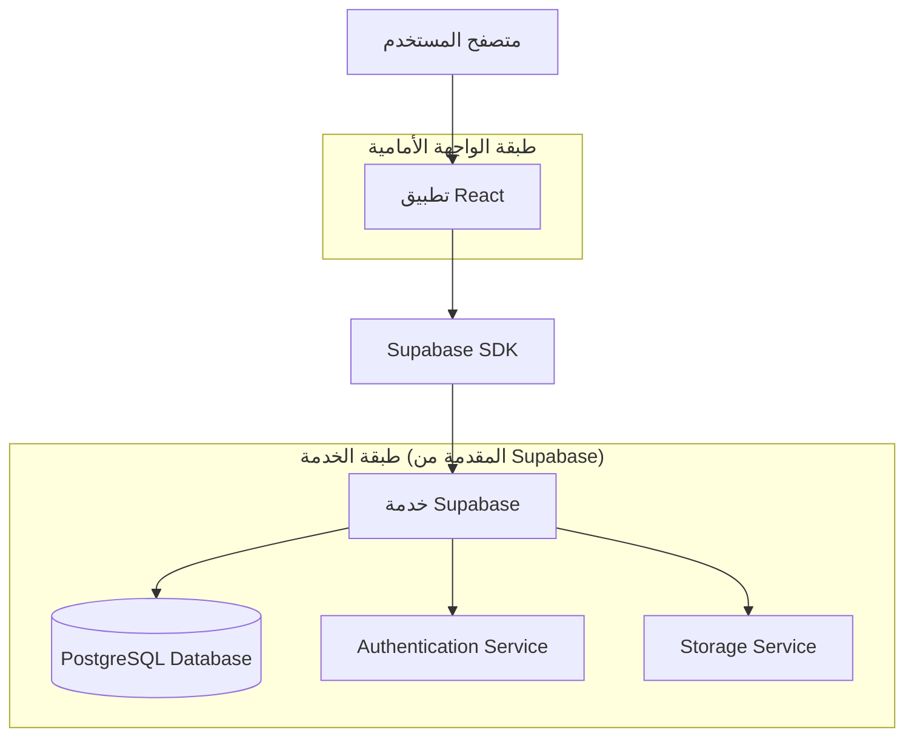
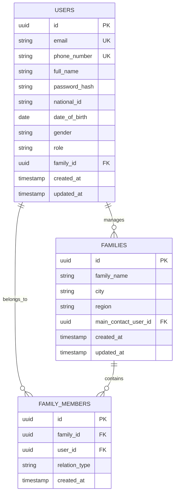

## 1. تصميم البنية التحتية



## 2. وصف التكنولوجيا
- الواجهة الأمامية: React@18 + TailwindCSS@3 + Vite
- أداة التهيئة: vite-init
- الخلفية: Supabase (Backend-as-a-Service)
- قاعدة البيانات: PostgreSQL (عبر Supabase)
- المصادقة: Supabase Auth
- التخزين: Supabase Storage (لصور المستخدمين)

## 3. تعريف المسارات
| المسار | الغرض |
|-------|--------|
| / | الصفحة الرئيسية، عرض المحتوى الرئيسي والتنقل |
| /login | صفحة تسجيل الدخول، تسمح للمستخدمين بالمصادقة |
| /register | صفحة إنشاء الحساب، إنشاء حساب جديد وربط العائلة |
| /dashboard | لوحة التحكم، عرض بطاقات الخدمات الأساسية |
| /family-members | صفحة الأفراد، عرض جميع أفراد العائلة |
| /profile | صفحة الملف الشخصي، عرض وتعديل بيانات المستخدم |
| /family-management | إدارة العائلة، إضافة وتعديل بيانات العائلة |
| /appointments | صفحة المواعيد، عرض وإدارة المواعيد العائلية |
| /notifications | صفحة التنبيهات، عرض التنبيهات والإشعارات |

## 4. نموذج البيانات

### 4.1 تعريف نموذج البيانات


### 4.2 لغة تعريف البيانات

جدول المستخدمين (users)
```sql
-- إنشاء الجدول
CREATE TABLE users (
    id UUID PRIMARY KEY DEFAULT gen_random_uuid(),
    email VARCHAR(255) UNIQUE,
    phone_number VARCHAR(20) UNIQUE,
    full_name VARCHAR(100) NOT NULL,
    password_hash VARCHAR(255) NOT NULL,
    national_id VARCHAR(20),
    date_of_birth DATE,
    gender VARCHAR(10) CHECK (gender IN ('ذكر', 'أنثى')),
    role VARCHAR(20) DEFAULT 'عضو' CHECK (role IN ('أب', 'أم', 'ابن', 'ابنة', 'عضو')),
    family_id UUID,
    created_at TIMESTAMP WITH TIME ZONE DEFAULT NOW(),
    updated_at TIMESTAMP WITH TIME ZONE DEFAULT NOW()
);

-- إنشاء الفهارس
CREATE INDEX idx_users_email ON users(email);
CREATE INDEX idx_users_phone ON users(phone_number);
CREATE INDEX idx_users_family_id ON users(family_id);
```

جدول العائلات (families)
```sql
-- إنشاء الجدول
CREATE TABLE families (
    id UUID PRIMARY KEY DEFAULT gen_random_uuid(),
    family_name VARCHAR(100) NOT NULL,
    city VARCHAR(50),
    region VARCHAR(50),
    main_contact_user_id UUID,
    created_at TIMESTAMP WITH TIME ZONE DEFAULT NOW(),
    updated_at TIMESTAMP WITH TIME ZONE DEFAULT NOW()
);

-- إنشاء الفهارس
CREATE INDEX idx_families_main_contact ON families(main_contact_user_id);
```

جدول أفراد العائلة (family_members)
```sql
-- إنشاء الجدول
CREATE TABLE family_members (
    id UUID PRIMARY KEY DEFAULT gen_random_uuid(),
    family_id UUID NOT NULL,
    user_id UUID NOT NULL,
    relation_type VARCHAR(20) CHECK (relation_type IN ('أب', 'أم', 'ابن', 'ابنة', 'أخ', 'أخت')),
    created_at TIMESTAMP WITH TIME ZONE DEFAULT NOW(),
    UNIQUE(family_id, user_id)
);

-- إنشاء الفهارس
CREATE INDEX idx_family_members_family_id ON family_members(family_id);
CREATE INDEX idx_family_members_user_id ON family_members(user_id);
```

## 5. سياسات الأمان والوصول

### 5.1 سياسات Supabase Row Level Security (RLS)

سياسات جدول users:
```sql
-- تمكين RLS
ALTER TABLE users ENABLE ROW LEVEL SECURITY;

-- السماح للمستخدمين المجهولين بإنشاء حسابات
CREATE POLICY "إنشاء حساب جديد" ON users
    FOR INSERT WITH CHECK (true);

-- السماح للمستخدمين المصادق عليهم بقراءة بياناتهم
CREATE POLICY "قراءة البيانات الشخصية" ON users
    FOR SELECT USING (auth.uid() = id);

-- السماح للمستخدمين المصادق عليهم بتحديث بياناتهم
CREATE POLICY "تحديث البيانات الشخصية" ON users
    FOR UPDATE USING (auth.uid() = id);
```

سياسات جدول families:
```sql
-- تمكين RLS
ALTER TABLE families ENABLE ROW LEVEL SECURITY;

-- السماح لأعضاء العائلة بقراءة بيانات العائلة
CREATE POLICY "قراءة بيانات العائلة" ON families
    FOR SELECT USING (
        EXISTS (
            SELECT 1 FROM family_members 
            WHERE family_members.family_id = families.id 
            AND family_members.user_id = auth.uid()
        )
    );

-- السماح لمسؤول العائلة بتحديث بيانات العائلة
CREATE POLICY "تحديث بيانات العائلة" ON families
    FOR UPDATE USING (main_contact_user_id = auth.uid());
```

سياسات جدول family_members:
```sql
-- تمكين RLS
ALTER TABLE family_members ENABLE ROW LEVEL SECURITY;

-- السماح لأعضاء العائلة بقراءة أفراد عائلتهم
CREATE POLICY "قراءة أفراد العائلة" ON family_members
    FOR SELECT USING (
        EXISTS (
            SELECT 1 FROM family_members fm
            WHERE fm.family_id = family_members.family_id 
            AND fm.user_id = auth.uid()
        )
    );

-- السماح لمسؤول العائلة بإضافة أفراد جدد
CREATE POLICY "إضافة أفراد جدد" ON family_members
    FOR INSERT WITH CHECK (
        EXISTS (
            SELECT 1 FROM families 
            WHERE families.id = family_id 
            AND families.main_contact_user_id = auth.uid()
        )
    );
```

## 6. واجهات برمجة التطبيقات

### 6.1 واجهات المصادقة

تسجيل الدخول:
```
POST /api/auth/login
```

المعاملات:
| اسم المعامل | النوع | إلزامي | الوصف |
|-------------|--------|---------|--------|
| email_or_phone | string | نعم | البريد الإلكتروني أو رقم الجوال |
| password | string | نعم | كلمة المرور |

الاستجابة:
```json
{
    "user": {
        "id": "uuid",
        "full_name": "string",
        "email": "string",
        "family_id": "uuid"
    },
    "session": {
        "access_token": "string",
        "refresh_token": "string",
        "expires_in": "number"
    }
}
```

### 6.2 واجهات إدارة العائلة

الحصول على أفراد العائلة:
```
GET /api/family/:familyId/members
```

الاستجابة:
```json
{
    "family_id": "uuid",
    "family_name": "string",
    "members": [
        {
            "id": "uuid",
            "full_name": "string",
            "relation_type": "string",
            "profile_image": "string"
        }
    ]
}
```

إضافة فرد إلى العائلة:
```
POST /api/family/:familyId/members
```

المعاملات:
| اسم المعامل | النوع | إلزامي | الوصف |
|-------------|--------|---------|--------|
| user_id | uuid | نعم | معرف المستخدم |
| relation_type | string | نعم | نوع العلاقة (أب، أم، ابن، ابنة...) |

## 7. التكوين والبيئة

### 7.1 متغيرات البيئة
```env
VITE_SUPABASE_URL=your_supabase_url
VITE_SUPABASE_ANON_KEY=your_supabase_anon_key
VITE_APP_NAME=عائلة ابشر
VITE_APP_VERSION=1.0.0
```

### 7.2 التبعيات الرئيسية
```json
{
    "dependencies": {
        "@supabase/supabase-js": "^2.38.0",
        "react": "^18.2.0",
        "react-dom": "^18.2.0",
        "react-router-dom": "^6.8.0",
        "tailwindcss": "^3.3.0"
    },
    "devDependencies": {
        "@vitejs/plugin-react": "^4.0.0",
        "vite": "^4.4.0",
        "autoprefixer": "^10.4.0",
        "postcss": "^8.4.0"
    }
}
```

## 8. الإرشادات التقنية

### 8.1 معايير التصميم
- استخدام TailwindCSS مع تصميم RTL مخصص
- دعم اللغة العربية كلغة افتراضية مع دعم الإنجليزية
- تصميم متجاوب يبدأ من الجوال (Mobile-first)
- تحميل الصور والموارد بطريقة كسول (Lazy loading)

### 8.2 معايير الأمان
- تشفير كلمات المرور باستخدام bcrypt
- استخدام JWT للمصادقة مع التحديث التلقائي للرموز
- التحقق من صحة جميع المدخلات على الواجهة الأمامية والخلفية
- حماية ضد هجمات XSS وCSRF

### 8.3 الأداء
- استخدام React.memo و useMemo للتحسين
- تنفيذ التحميل الكسول للمكونات
- تخزين مؤقت للبيانات غير المتغيرة
- ضغط الصور والموارد الثابتة